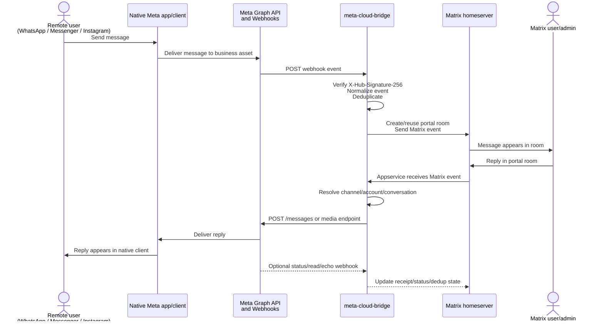
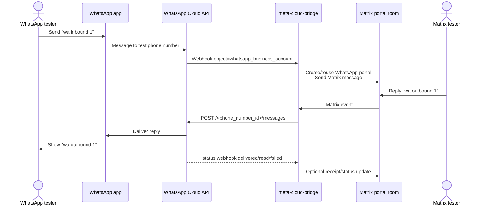
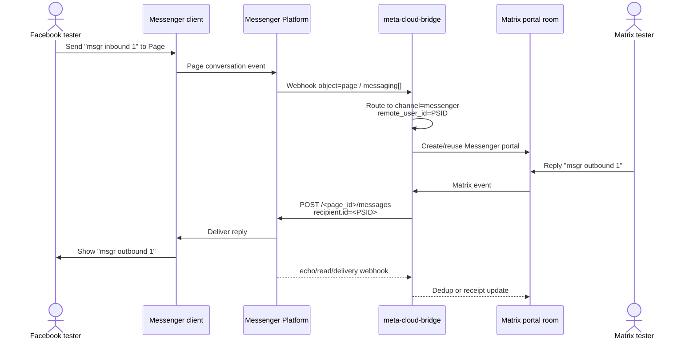
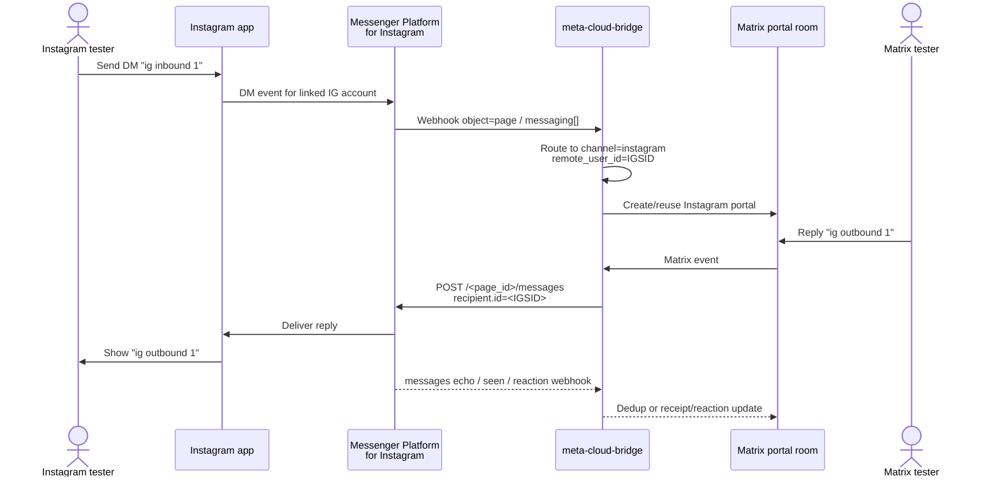

# End-to-End Acceptance Guide

Date: 2026-05-07

This guide is for the person who will run the final end-to-end acceptance tests for `meta-cloud-bridge`.

It assumes that a Matrix homeserver is already running and usable. It does **not** assume that Meta assets have already been configured.

The goal is to prove that the bridge can send and receive messages between Matrix and the official Meta messaging APIs:

- WhatsApp Cloud API
- Facebook Messenger Platform
- Instagram Messaging via Messenger Platform
- Optionally, Instagram Messaging via Instagram Login (`graph.instagram.com`)

> Repository language policy: this document is written in English to keep project documentation consistent.

## 1. Acceptance scope

A channel is considered accepted when a tester can complete the full loop:

1. A remote user sends a message from the native Meta app/client.
2. The bridge receives the webhook from Meta.
3. The bridge creates or reuses the correct Matrix portal room.
4. The message appears in Matrix.
5. A Matrix user replies in that portal room.
6. The bridge sends the reply through the correct Meta Graph API endpoint.
7. The remote user receives the reply in the native Meta app/client.
8. Media, replies, reactions/read receipts, and duplicate webhook handling are verified where supported.

## 2. High-level message flow



## 3. Required accounts and assets

### Already assumed

- A working Matrix homeserver.
- A Matrix user who can administer or invite the bridge.
- A host where the bridge can run.
- A database for the bridge.

### Required for all Meta live tests

- A Meta developer account: <https://developers.facebook.com/>
- A Meta app in Development Mode.
- The app's App ID.
- The app's App Secret.
- A webhook Verify Token that you choose.
- A public HTTPS URL for the bridge webhook.
  - Examples: `https://bridge.example.com/cloud/receive`, ngrok, cloudflared tunnel, Tailscale Funnel, or a real reverse proxy with TLS.
  - Meta does not accept self-signed TLS certificates for webhook configuration.
- App role users for testing:
  - At least one Admin/Developer account.
  - At least one Tester or Consumer Tester account if another person will test.

### Channel-specific test assets

| Channel | Required asset | Required tester |
|---|---|---|
| WhatsApp | Meta-provided WhatsApp Cloud API test phone number or a real WABA phone number | A real WhatsApp phone number added as test recipient |
| Messenger | Facebook Page connected to the app | Facebook account with app role/test access that can message the Page |
| Instagram via Messenger Platform | Instagram Professional account linked to a Facebook Page | Instagram account that can DM the professional account |
| Instagram Login mode | Instagram Professional account authenticated with Instagram Login | Instagram account that can DM the professional account |

## 4. Public webhook URL requirements

Before using the Meta App Dashboard, make sure the bridge endpoint will be publicly reachable.

Expected callback URL format:

```text
https://<public-host>/cloud/receive
```

The endpoint must support:

- `GET /cloud/receive` for Meta verification.
- `POST /cloud/receive` for webhook events.
- HMAC validation of `X-Hub-Signature-256` using the Meta App Secret.

Recommended preflight check once the bridge is running:

```bash
curl -i \
  "https://<public-host>/cloud/receive?hub.mode=subscribe&hub.verify_token=<VERIFY_TOKEN>&hub.challenge=CHALLENGE_ACCEPTED"
```

Expected response:

```text
HTTP/2 200
CHALLENGE_ACCEPTED
```

If this fails, do not continue with the Meta dashboard setup. Fix DNS, TLS, reverse proxy routing, bridge config, or verify-token mismatch first.

## 5. Create and configure the Meta app

Meta dashboard UI changes over time, but the workflow is generally the same.

### 5.1 Create the app

1. Open <https://developers.facebook.com/apps/>.
2. Click **Create App**.
3. Choose an app type/use case compatible with business messaging.
   - For Messenger and Page-linked Instagram, a Business/Facebook Login use case is usually required.
   - For Instagram Login mode, use the Instagram API / Instagram Login setup path if available.
4. Enter app name and contact email.
5. Attach the app to the correct Business Portfolio if required.
6. Keep the app in **Development Mode** for testing.

Record:

```text
META_APP_ID=
META_APP_SECRET=
META_VERIFY_TOKEN=<your chosen verify token>
META_API_VERSION=v25.0 or the version selected in your app
```

### 5.2 Add app roles

1. In the App Dashboard, open **App roles** / **Roles**.
2. Add QA users as Admins, Developers, Testers, or Consumer Testers.
3. Ask each invited person to accept the role invitation.

Acceptance requirement:

- Every human tester who interacts with the app while it is in Development Mode must have a role on the app or use a supported test asset.

### 5.3 Configure shared webhook callback

Depending on the product, webhook configuration may appear under **Webhooks**, **Messenger > Settings**, **WhatsApp > Configuration**, or **Instagram settings**.

Use the same callback for all supported channels:

```text
Callback URL: https://<public-host>/cloud/receive
Verify Token: <META_VERIFY_TOKEN>
```

When Meta verifies the callback, the bridge must return the `hub.challenge` value.

Subscribe to the fields needed by each channel in the sections below.

## 6. Configure the bridge for live acceptance

The exact config keys may change as the multichannel implementation evolves. The final implementation should provide an equivalent of the following information.

### 6.1 Shared bridge settings

```yaml
meta:
  graph_base_url: https://graph.facebook.com
  instagram_base_url: https://graph.instagram.com
  version: v25.0
  app_id: "<META_APP_ID>"
  app_secret: "<META_APP_SECRET>"
  webhook_path: /cloud
  verify_token: "<META_VERIFY_TOKEN>"
  require_webhook_signature: true
```

### 6.2 Channel account records

The bridge must know which Meta assets belong to which channel.

Example configuration:

```yaml
meta:
  accounts:
    - id: whatsapp-test-number
      channel: whatsapp
      waba_id: "<WA_WABA_ID>"
      phone_number_id: "<WA_PHONE_NUMBER_ID>"
      access_token: "<WA_ACCESS_TOKEN>"

    - id: messenger-test-page
      channel: messenger
      page_id: "<FB_PAGE_ID>"
      access_token: "<FB_PAGE_ACCESS_TOKEN>"

    - id: instagram-page-linked
      channel: instagram
      page_id: "<IG_LINKED_PAGE_ID>"
      instagram_user_id: "<IG_PROFESSIONAL_ACCOUNT_ID>"
      access_token: "<IG_PAGE_ACCESS_TOKEN>"

    - id: instagram-login-test
      channel: instagram_login
      instagram_user_id: "<IG_LOGIN_ACCOUNT_ID>"
      access_token: "<IG_LOGIN_ACCESS_TOKEN>"
```

Acceptance requirement:

- Each configured account must have a stable `(channel, asset_id)` identity.
- Portal rooms must be keyed by `(channel, asset_id, remote_user_id)`.

### 6.3 Run the bridge

The current upstream-style command is:

```bash
uv run meta-cloud-bridge
```

Verify logs show:

- bridge started successfully;
- appservice connected to Matrix;
- webhook route mounted;
- no token/secret leaked in logs.

## 7. WhatsApp Cloud API setup and acceptance

### 7.1 Configure WhatsApp in Meta portal

1. In the App Dashboard, add or open the **WhatsApp** product.
2. Open **API Setup** / **Getting Started**.
3. Select or create the Meta-provided test business phone number.
4. Record:

```text
WA_WABA_ID=
WA_PHONE_NUMBER_ID=
WA_ACCESS_TOKEN=
```

5. Add the tester's real WhatsApp phone number as a test recipient.
   - The tester may need to confirm a code sent by Meta.
6. Open WhatsApp webhook configuration.
7. Set the callback URL:

```text
https://<public-host>/cloud/receive
```

8. Set the verify token to `<META_VERIFY_TOKEN>`.
9. Subscribe to the WhatsApp `messages` webhook field.
10. Save and verify the callback.

### 7.2 WhatsApp E2E test flow



### 7.3 WhatsApp acceptance checklist

Inbound:

- [ ] Tester sends text from WhatsApp to the test phone number.
- [ ] Matrix portal room is created or reused.
- [ ] Message body, sender identity, timestamp, and channel are correct.
- [ ] Tester sends image.
- [ ] Image appears in Matrix with correct media fallback if needed.
- [ ] Tester sends PDF/file if supported by the test setup.
- [ ] File appears in Matrix.

Outbound:

- [ ] Matrix tester sends text in the portal room.
- [ ] Tester receives the text in WhatsApp.
- [ ] Matrix tester sends image/file.
- [ ] Tester receives media in WhatsApp.
- [ ] Matrix tester replies to an earlier message.
- [ ] WhatsApp shows the reply context if supported.

Status/dedup:

- [ ] Delivered/read/failed status webhooks are logged and handled.
- [ ] Replaying the same inbound webhook does not duplicate the Matrix message.
- [ ] Graph API errors are shown as readable Matrix/admin notices.

## 8. Messenger setup and acceptance

### 8.1 Configure Messenger in Meta portal

1. Create or select a Facebook Page dedicated to QA, for example `Meta Cloud Bridge QA`.
2. In the App Dashboard, add or open the **Messenger** product.
3. Generate a Page Access Token for the QA Page.
4. Record:

```text
FB_PAGE_ID=
FB_PAGE_ACCESS_TOKEN=
```

5. Connect/install the app to the Page.
6. Configure Messenger webhooks with:

```text
Callback URL: https://<public-host>/cloud/receive
Verify Token: <META_VERIFY_TOKEN>
```

7. Subscribe to recommended Page/Messenger fields:

```text
messages
message_echoes
message_deliveries
message_reads
message_reactions
messaging_postbacks
messaging_referrals
standby
```

8. Save and verify.
9. Make sure the Facebook tester account has a role on the app while the app is in Development Mode.

### 8.2 Messenger E2E test flow



### 8.3 Messenger acceptance checklist

Inbound:

- [ ] Tester sends text to the QA Page.
- [ ] Matrix portal room is created with channel `messenger`.
- [ ] The remote user ID is stored as PSID.
- [ ] Tester sends image/file/audio/video where available.
- [ ] Attachments appear in Matrix.
- [ ] Tester sends a postback/quick reply if configured.
- [ ] Postback is represented in Matrix.

Outbound:

- [ ] Matrix tester sends text.
- [ ] Facebook tester receives the message in Messenger.
- [ ] Outbound request uses `POST /<PAGE_ID>/messages` or `/me/messages` with a Page token.
- [ ] Payload includes `recipient.id=<PSID>`.
- [ ] Payload includes valid `messaging_type`, typically `RESPONSE` inside the 24-hour window.
- [ ] Matrix tester sends image/file.
- [ ] Facebook tester receives media.
- [ ] Matrix tester replies to an earlier message.
- [ ] Messenger reply context works if supported.

Status/dedup:

- [ ] `message_echoes` do not create duplicate Matrix messages.
- [ ] `message_reads` and `message_deliveries` are processed or safely ignored.
- [ ] Duplicate webhook replay does not duplicate Matrix events.

## 9. Instagram Messaging via Messenger Platform setup and acceptance

This mode is for Instagram Professional accounts linked to a Facebook Page. It uses Messenger Platform-style Page webhooks and Page access tokens.

### 9.1 Configure Instagram in Meta portal and Instagram settings

1. Create or select an Instagram Professional account dedicated to QA.
2. Link the Instagram Professional account to the QA Facebook Page.
3. In Instagram settings, enable message access for connected tools:

```text
Instagram Settings
  -> Messages and story replies
  -> Message controls
  -> Connected Tools
  -> Allow Access to Messages
```

4. In the App Dashboard, add/open the Messenger or Instagram Messaging product.
5. Request/use permissions needed for testing:

```text
instagram_manage_messages
pages_manage_metadata
pages_show_list
```

6. Generate or obtain a Page Access Token for the linked Page.
7. Record:

```text
IG_LINKED_PAGE_ID=
IG_PROFESSIONAL_ACCOUNT_ID=
IG_PAGE_ACCESS_TOKEN=
```

8. Configure webhook callback:

```text
Callback URL: https://<public-host>/cloud/receive
Verify Token: <META_VERIFY_TOKEN>
```

9. Subscribe to Instagram/Messenger fields:

```text
messages
messaging_seen
message_reactions
messaging_postbacks
messaging_referrals
standby
```

10. Save and verify.
11. Make sure the Instagram tester is allowed to interact during Development Mode.

### 9.2 Instagram Page-linked E2E test flow



### 9.3 Instagram Page-linked acceptance checklist

Inbound:

- [ ] Tester sends DM text to the Instagram Professional account.
- [ ] Matrix portal room is created with channel `instagram`.
- [ ] The remote user ID is stored as IGSID.
- [ ] Payload arrives as `object=page` and is not misrouted as Messenger.
- [ ] Tester sends image/video/audio/file where supported.
- [ ] Media appears in Matrix.
- [ ] Tester reacts to a message if supported.
- [ ] Reaction appears in Matrix or is safely logged as unsupported.

Outbound:

- [ ] Matrix tester sends text.
- [ ] Instagram tester receives the DM.
- [ ] Outbound request uses `POST /<PAGE_ID>/messages` or `/me/messages` with Page token.
- [ ] Payload includes `recipient.id=<IGSID>`.
- [ ] Matrix tester sends image/video/file within Instagram limits.
- [ ] Instagram tester receives media.
- [ ] Matrix tester replies to an earlier message.
- [ ] Instagram shows reply context if supported.

Status/dedup:

- [ ] Instagram echoes contained in `messages` do not create duplicate Matrix messages.
- [ ] `messaging_seen` is processed or safely ignored.
- [ ] Duplicate webhook replay does not duplicate Matrix events.

## 10. Optional: Instagram Login mode setup and acceptance

This mode is separate from Page-linked Instagram Messaging. It uses `graph.instagram.com` and an Instagram User access token.

### 10.1 Configure Instagram Login in Meta portal

1. In the App Dashboard, configure the Instagram API with Instagram Login product/path.
2. Use an Instagram Professional account.
3. Complete the Instagram Login or Business Login for Instagram flow.
4. Request scopes:

```text
instagram_business_basic
instagram_business_manage_messages
```

5. Record:

```text
IG_LOGIN_ACCOUNT_ID=
IG_LOGIN_ACCESS_TOKEN=
```

6. Configure Instagram webhooks if supported by the chosen setup:

```text
Callback URL: https://<public-host>/cloud/receive
Verify Token: <META_VERIFY_TOKEN>
```

7. Subscribe to:

```text
messages
messaging_optins
messaging_postbacks
messaging_reactions
messaging_referrals
messaging_seen
```

### 10.2 Instagram Login acceptance checklist

- [ ] Inbound Instagram DM reaches Matrix with channel `instagram_login`.
- [ ] Matrix reply is sent via `https://graph.instagram.com/<version>/<IG_ID|me>/messages`.
- [ ] The implementation does not accidentally use `graph.facebook.com` Page endpoints for this mode.
- [ ] Media/replies/reactions are handled according to Instagram Login API capabilities.

## 11. Webhook replay acceptance test

For every channel, save one sanitized real webhook payload after the first live test.

Recommended fixture paths:

```text
tests/fixtures/meta/whatsapp/inbound_text.json
tests/fixtures/meta/whatsapp/inbound_image.json
tests/fixtures/meta/messenger/inbound_text.json
tests/fixtures/meta/messenger/echo.json
tests/fixtures/meta/instagram_page/inbound_text.json
tests/fixtures/meta/instagram_page/seen.json
tests/fixtures/meta/instagram_login/inbound_text.json
```

Replay the same webhook twice.

Expected result:

- first replay creates or updates exactly one Matrix event;
- second replay is detected as duplicate;
- no duplicate Matrix message is created;
- logs show a clear dedup decision.

Conceptual command:

```bash
python -m tests.tools.replay_webhook \
  --url https://<public-host>/cloud/receive \
  --app-secret "$META_APP_SECRET" \
  tests/fixtures/meta/messenger/inbound_text.json
```

If the final implementation provides a different replay tool, use that documented command.

## 12. Media acceptance matrix

| Direction | WhatsApp | Messenger | Instagram Page-linked | Instagram Login |
|---|---|---|---|---|
| Remote text → Matrix | Required | Required | Required | Required if enabled |
| Matrix text → Remote | Required | Required | Required | Required if enabled |
| Remote image → Matrix | Required | Required | Required | Required if enabled |
| Matrix image → Remote | Required | Required | Required | Required if enabled |
| Remote PDF/file → Matrix | Required where supported | Required where supported | Required where supported | Required where supported |
| Matrix PDF/file → Remote | Required where supported | Required where supported | Required where supported | Required where supported |
| Remote audio/video → Matrix | Required where supported | Required where supported | Required where supported | Required where supported |
| Matrix audio/video → Remote | Required where supported | Required where supported | Required where supported | Required where supported |

Record any unsupported media type as:

```text
Unsupported by channel/API: <reason and official limitation if known>
```

Unsupported media should produce a readable Matrix notice, not a bridge crash.

## 13. Error acceptance tests

At least one tester/admin should intentionally trigger or simulate the following errors:

- invalid or expired access token;
- missing permission;
- Meta 4xx error;
- Meta 5xx error;
- unsupported media type;
- media too large;
- webhook with invalid HMAC signature;
- webhook duplicate delivery;
- webhook received for an unknown asset/account.

Acceptance criteria:

- bridge process does not crash;
- Matrix/admin receives a useful notice where appropriate;
- logs include `channel`, `asset_id`, and remote message/user identifiers where available;
- secrets/tokens are not logged;
- retryable errors are distinguishable from permanent errors.

## 14. Sign-off checklist

### Global

- [ ] Matrix homeserver works before starting acceptance.
- [ ] Bridge starts cleanly.
- [ ] Public HTTPS webhook URL works.
- [ ] Meta verification GET succeeds.
- [ ] Valid webhook signature is accepted.
- [ ] Invalid webhook signature is rejected.
- [ ] Tokens/secrets are not visible in logs.
- [ ] Duplicate webhook delivery does not duplicate messages.
- [ ] All portal rooms use correct channel identity.

### WhatsApp

- [ ] Inbound text accepted.
- [ ] Outbound text accepted.
- [ ] Inbound media accepted.
- [ ] Outbound media accepted.
- [ ] Reply context accepted.
- [ ] Status/error webhook accepted.

### Messenger

- [ ] Inbound text accepted.
- [ ] Outbound text accepted.
- [ ] Inbound media accepted.
- [ ] Outbound media accepted.
- [ ] Echo dedup accepted.
- [ ] Read/delivery webhook accepted.

### Instagram Page-linked

- [ ] Inbound text accepted.
- [ ] Outbound text accepted.
- [ ] Inbound media accepted.
- [ ] Outbound media accepted.
- [ ] Correctly routed as Instagram despite `object=page`.
- [ ] Echo/seen/reaction handling accepted.

### Instagram Login mode, if enabled

- [ ] Inbound text accepted.
- [ ] Outbound text accepted.
- [ ] Uses `graph.instagram.com`.
- [ ] Does not require a linked Facebook Page.
- [ ] Webhooks normalize to the same event model.

## 15. Acceptance record

Fill this out when the test run is complete.

```text
Tester name:
Date:
Bridge commit/version:
Matrix homeserver version:
Meta API version:
Public webhook URL:

WhatsApp asset tested:
Messenger Page tested:
Instagram Page-linked account tested:
Instagram Login account tested:

Passed channels:
Failed channels:
Known limitations:
Blocking issues:
Follow-up issues:

Final decision:
[ ] Accepted
[ ] Accepted with known limitations
[ ] Rejected / requires fixes
```

## 16. Troubleshooting

### Meta cannot verify webhook

Check:

- URL is public HTTPS.
- Certificate is valid and not self-signed.
- Reverse proxy routes `GET /cloud/receive` to the bridge.
- Verify token in Meta dashboard matches bridge config.
- Bridge logs show the GET request.

### Webhooks do not arrive

Check:

- App is installed/subscribed to the Page or WhatsApp asset.
- Correct webhook fields are subscribed.
- Tester has an app role while app is in Development Mode.
- For Instagram, connected tools message access is enabled.
- Meta dashboard shows webhook delivery errors.
- Bridge returns `200 OK` within Meta's timeout.

### Outbound messages fail

Check:

- Correct access token type:
  - WhatsApp token for WhatsApp phone number.
  - Page token for Messenger and Page-linked Instagram.
  - Instagram User token for Instagram Login mode.
- Required permission is granted.
- 24-hour customer service window is open, or the message type/template is allowed.
- Recipient ID is correct:
  - WhatsApp `wa_id` / phone number.
  - Messenger PSID.
  - Instagram IGSID.
- The channel adapter is using the correct endpoint.

### Messenger and Instagram are mixed up

Both Messenger and Page-linked Instagram can arrive as `object=page`. Check:

- configured account table includes both channel and asset ID;
- Page ID mappings are correct;
- sender/recipient scoped IDs are stored with their channel;
- Instagram echoes inside `messages` are treated differently from Messenger `message_echoes`.

### Media fails

Check:

- file size is within channel limits;
- MIME type is supported by the channel;
- Matrix media can be downloaded by the bridge;
- Meta can fetch any public media URL used for Messenger/Instagram;
- WhatsApp media upload returned a valid media ID before sending.
