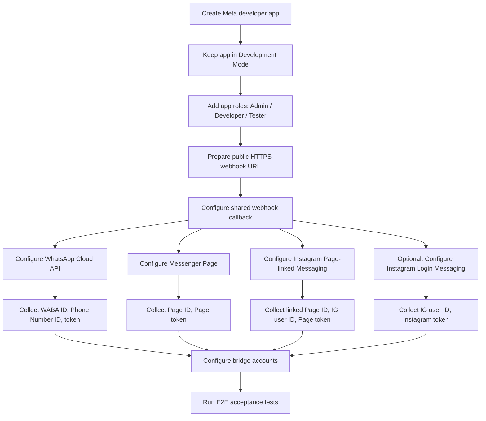
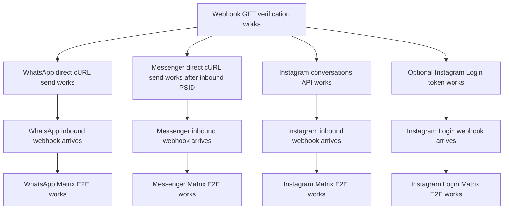

# Meta Channel Configuration Guide

Date: 2026-05-07

This guide explains how to configure Meta assets for end-to-end testing and deployment of `meta-cloud-bridge`.

It covers:

- Meta app setup
- shared webhook setup
- WhatsApp Cloud API setup, including activating a phone number
- Facebook Messenger Page setup
- Instagram Messaging via Messenger Platform setup
- optional Instagram Messaging via Instagram Login setup
- tokens, permissions, and validation checks

This document assumes the Matrix homeserver and bridge host already exist.

> Meta dashboard labels and menus change over time. Treat the steps below as the intended workflow and verify details against the current official Meta documentation when running the setup.

## Official documentation entry points

- WhatsApp Cloud API Get Started: <https://developers.facebook.com/docs/whatsapp/cloud-api/get-started>
- WhatsApp Cloud API Webhooks: <https://developers.facebook.com/docs/whatsapp/cloud-api/guides/set-up-webhooks>
- WhatsApp Cloud API Messages: <https://developers.facebook.com/docs/whatsapp/cloud-api/reference/messages>
- WhatsApp phone numbers / registration: <https://developers.facebook.com/docs/whatsapp/cloud-api/get-started/documentation/business-messaging/whatsapp/business-phone-numbers/registration/>
- Messenger Platform: <https://developers.facebook.com/docs/messenger-platform/>
- Messenger Platform Webhooks: <https://developers.facebook.com/docs/messenger-platform/webhooks>
- Messenger Send API: <https://developers.facebook.com/docs/messenger-platform/send-messages/>
- Instagram Messaging API: <https://developers.facebook.com/docs/messenger-platform/instagram>
- Instagram Messaging Get Started: <https://developers.facebook.com/docs/messenger-platform/instagram/get-started>
- Instagram API with Instagram Login: <https://developers.facebook.com/docs/instagram-platform/instagram-api-with-instagram-login/>
- Graph API Webhooks: <https://developers.facebook.com/docs/graph-api/webhooks/>
- App Roles: <https://developers.facebook.com/docs/development/build-and-test/app-roles/>

## 1. Configuration overview



## 2. Shared prerequisites

Before configuring any channel, prepare these values:

```bash
PUBLIC_WEBHOOK_URL=https://<public-host>/cloud/receive
META_VERIFY_TOKEN=<random-string-you-control>
META_API_VERSION=v25.0
```

Requirements:

- `PUBLIC_WEBHOOK_URL` must be reachable from the public internet over HTTPS.
- TLS certificate must be valid. Self-signed certificates are not accepted by Meta.
- The bridge must answer Meta verification requests:

```bash
curl -i \
  "$PUBLIC_WEBHOOK_URL?hub.mode=subscribe&hub.verify_token=$META_VERIFY_TOKEN&hub.challenge=CHALLENGE_ACCEPTED"
```

Expected response:

```text
HTTP 200
CHALLENGE_ACCEPTED
```

## 3. Create the Meta app

1. Open <https://developers.facebook.com/apps/>.
2. Click **Create App**.
3. Choose an app type/use case compatible with business messaging.
   - For Messenger and Page-linked Instagram, choose a business-oriented app/use case.
   - For Instagram Login mode, enable/configure the Instagram API with Instagram Login product/path.
4. Enter app name and contact email.
5. Attach the app to the relevant Business Portfolio if Meta asks for it.
6. Keep the app in **Development Mode** while testing.
7. Open **App settings > Basic** and record:

```bash
META_APP_ID=
META_APP_SECRET=
```

8. Add required products depending on scope:
   - WhatsApp
   - Messenger
   - Instagram Messaging / Instagram product
   - Webhooks, if shown separately

## 4. Add app roles and testers

While the app is in Development Mode, only role/test users can exercise most features.

1. In the App Dashboard, open **Roles** / **App roles**.
2. Add QA accounts as one of:
   - Admin
   - Developer
   - Tester
   - Consumer Tester, if applicable
3. Ask invitees to accept the role invitation.
4. Use these role accounts for live acceptance tests.

Acceptance checkpoint:

- Every Facebook/Instagram tester that interacts with the app before App Review must have the required role or be using a supported test asset.

## 5. Configure the shared webhook callback

The same bridge endpoint can receive all Meta webhook traffic.

Callback values:

```text
Callback URL: https://<public-host>/cloud/receive
Verify Token: <META_VERIFY_TOKEN>
```

Meta will issue a `GET` request with:

```text
hub.mode=subscribe
hub.verify_token=<META_VERIFY_TOKEN>
hub.challenge=<number-or-string>
```

The bridge must return the challenge verbatim.

POST requests should be signed with:

```text
X-Hub-Signature-256: sha256=<hmac>
```

The bridge should validate this signature using the app secret.

## 6. WhatsApp Cloud API configuration

There are two practical WhatsApp setup paths:

1. **Test number path**: best for development and acceptance.
2. **Real business phone number path**: needed for production-like testing and real deployment.

### 6.1 WhatsApp test number path

This is the fastest way to validate the bridge.

1. In the Meta App Dashboard, add/open the **WhatsApp** product.
2. Open **API Setup** / **Getting Started**.
3. Meta provides a test business phone number.
4. Record:

```bash
WA_WABA_ID=
WA_PHONE_NUMBER_ID=
WA_ACCESS_TOKEN=
```

5. Add a recipient phone number:
   - Open the recipient/test number section.
   - Add the tester's real WhatsApp phone number.
   - Complete any confirmation code flow Meta requires.
6. Send Meta's sample `hello_world` message from the dashboard or with cURL to confirm the test number works.

Expected send endpoint:

```http
POST https://graph.facebook.com/<API_VERSION>/<WA_PHONE_NUMBER_ID>/messages
Authorization: Bearer <WA_ACCESS_TOKEN>
```

Sample text test:

```bash
curl -X POST \
  "https://graph.facebook.com/$META_API_VERSION/$WA_PHONE_NUMBER_ID/messages" \
  -H "Authorization: Bearer $WA_ACCESS_TOKEN" \
  -H "Content-Type: application/json" \
  -d '{
    "messaging_product": "whatsapp",
    "recipient_type": "individual",
    "to": "<RECIPIENT_PHONE_E164_WITHOUT_PLUS>",
    "type": "text",
    "text": { "body": "WhatsApp Cloud API test" }
  }'
```

If this works, the Meta-side test number is ready.

### 6.2 Real WhatsApp business phone number path

Use this when you need a real business sender instead of Meta's test number.

Important constraints before starting:

- The phone number must be able to receive SMS or voice verification.
- The number usually cannot be actively used by the regular WhatsApp or WhatsApp Business mobile app at the same time unless you are using a supported coexistence/migration flow.
- If the number is already registered elsewhere, read Meta's migration/coexistence docs before changing it.
- Display name approval and business verification can affect production readiness.

Recommended UI path:

1. Open <https://business.facebook.com/>.
2. Go to **Business Settings**.
3. Open **Accounts > WhatsApp accounts**.
4. Select or create the WhatsApp Business Account (WABA).
5. Open **WhatsApp Manager**.
6. Go to **Phone numbers**.
7. Click **Add phone number**.
8. Enter business/profile details requested by Meta:
   - display name;
   - business category;
   - business description/website if required;
   - country and phone number.
9. Choose verification method:
   - SMS; or
   - voice call.
10. Enter the verification code sent by Meta.
11. Wait until the number appears in the WABA phone number list.
12. Record:

```bash
WA_WABA_ID=<WhatsApp Business Account ID>
WA_PHONE_NUMBER_ID=<Phone Number ID, not the human-readable phone number>
WA_DISPLAY_PHONE_NUMBER=<human-readable number>
```

After the number is added, check:

- number status is connected/ready;
- display name status is acceptable for your test;
- quality status has no blocking issue;
- messaging limits are sufficient for acceptance;
- payment/credit line requirements are satisfied if production messaging is needed.

### 6.3 Registering or enabling the WhatsApp number for Cloud API

For standard dashboard onboarding, Meta normally handles the registration steps when the number is added and verified. If using an API-driven or solution-provider flow, Meta may require explicit registration calls and a two-step verification PIN.

For bridge acceptance, the important final state is:

- the WABA exists;
- the phone number exists under that WABA;
- the phone number has a `phone_number_id`;
- the access token can send messages via `/<phone_number_id>/messages`;
- webhooks are subscribed and delivered.

Validation command:

```bash
curl -i \
  "https://graph.facebook.com/$META_API_VERSION/$WA_PHONE_NUMBER_ID?fields=id,display_phone_number,verified_name,quality_rating&access_token=$WA_ACCESS_TOKEN"
```

### 6.4 WhatsApp token for development vs production

For the dashboard test number, Meta provides a temporary token.

For longer-lived testing or deployment, use a Business/System User token:

1. Open **Business Settings**.
2. Go to **Users > System users**.
3. Create a system user for the bridge.
4. Assign assets:
   - Meta app;
   - WhatsApp Business Account;
   - optionally Page assets if the same system user will manage more channels.
5. Generate a token for the app.
6. Include required permissions:

```text
whatsapp_business_messaging
whatsapp_business_management
```

7. Store the token securely in the bridge configuration/secret store.

Acceptance checkpoint:

- Do not use dashboard temporary tokens for long-running bridge tests.
- Never commit tokens to git.

### 6.5 WhatsApp webhooks

1. In the App Dashboard, open **WhatsApp > Configuration** or the current webhook settings page.
2. Set:

```text
Callback URL: https://<public-host>/cloud/receive
Verify Token: <META_VERIFY_TOKEN>
```

3. Subscribe to:

```text
messages
```

4. Save and verify.
5. Send a WhatsApp message from the test recipient to the business/test number.
6. Confirm the bridge receives a webhook with:

```json
{
  "object": "whatsapp_business_account",
  "entry": [
    {
      "changes": [
        {
          "field": "messages"
        }
      ]
    }
  ]
}
```

### 6.6 WhatsApp bridge account configuration

Conceptual bridge account record:

```yaml
meta:
  accounts:
    - id: whatsapp-main
      channel: whatsapp
      waba_id: "<WA_WABA_ID>"
      phone_number_id: "<WA_PHONE_NUMBER_ID>"
      access_token: "<WA_ACCESS_TOKEN>"
```

## 7. Facebook Messenger configuration

Messenger uses a Facebook Page, Page Access Token, Page-scoped user IDs (PSIDs), and Page webhooks.

### 7.1 Create or choose a Facebook Page

1. Open Facebook or Meta Business Suite.
2. Create/select a QA Page, for example:

```text
Meta Cloud Bridge QA
```

3. Ensure your developer/admin account has permission to manage and message as the Page.

### 7.2 Add Messenger product and connect the Page

1. Open the Meta App Dashboard.
2. Add/open the **Messenger** product.
3. In Messenger settings, connect/select the QA Page.
4. Generate a Page Access Token if the dashboard offers it.
5. Record:

```bash
FB_PAGE_ID=
FB_PAGE_ACCESS_TOKEN=
```

Alternative token generation flow:

1. Use Facebook Login / Graph API Explorer to obtain a User Access Token with Page permissions.
2. Call:

```bash
curl -i \
  "https://graph.facebook.com/$META_API_VERSION/me/accounts?access_token=<USER_ACCESS_TOKEN>"
```

3. Find the QA Page in the response and copy its `access_token`.

For longer-lived testing, use the proper long-lived token flow instead of a short-lived Graph API Explorer token.

### 7.3 Messenger permissions

For development-mode testing, role users can grant/test permissions. For production/non-role users, App Review and Advanced Access are normally required.

Relevant permissions/features:

```text
pages_messaging
pages_manage_metadata
pages_show_list
```

### 7.4 Messenger webhooks

1. In the App Dashboard, open **Messenger > Settings** or **Webhooks**.
2. Set:

```text
Callback URL: https://<public-host>/cloud/receive
Verify Token: <META_VERIFY_TOKEN>
```

3. Subscribe the Page to webhook fields:

```text
messages
message_echoes
message_deliveries
message_reads
message_reactions
messaging_postbacks
messaging_referrals
standby
```

4. Save and verify.
5. If the dashboard has a **Test** button for webhook fields, send a test notification and confirm the bridge logs it.
6. From the Facebook tester account, send a message to the QA Page in Messenger.
7. Confirm the bridge receives a webhook with:

```json
{
  "object": "page",
  "entry": [
    {
      "id": "<PAGE_ID>",
      "messaging": [
        {
          "sender": { "id": "<PSID>" },
          "recipient": { "id": "<PAGE_ID>" },
          "message": { "mid": "...", "text": "..." }
        }
      ]
    }
  ]
}
```

### 7.5 Messenger send validation

After receiving an inbound message, the bridge learns the tester's PSID. Validate with:

```bash
curl -X POST \
  "https://graph.facebook.com/$META_API_VERSION/$FB_PAGE_ID/messages" \
  -H "Authorization: Bearer $FB_PAGE_ACCESS_TOKEN" \
  -H "Content-Type: application/json" \
  -d '{
    "recipient": { "id": "<PSID_FROM_WEBHOOK>" },
    "messaging_type": "RESPONSE",
    "message": { "text": "Messenger API test" }
  }'
```

Acceptance checkpoint:

- The remote tester receives the message in Messenger.
- If this fails, fix Page token/permissions/Page subscription before debugging the bridge.

### 7.6 Messenger bridge account configuration

```yaml
meta:
  accounts:
    - id: messenger-qa-page
      channel: messenger
      page_id: "<FB_PAGE_ID>"
      access_token: "<FB_PAGE_ACCESS_TOKEN>"
```

## 8. Instagram Messaging via Messenger Platform configuration

This mode is for an Instagram Professional account linked to a Facebook Page. It uses Messenger Platform-style Page webhooks and Page Access Tokens.

### 8.1 Prepare the Instagram account

1. Create or select an Instagram account dedicated to QA.
2. Convert it to a Professional account:
   - Business or Creator.
3. Link it to the QA Facebook Page.
   - This can be done from Instagram account settings, Meta Business Suite, or the Page/Instagram settings depending on current UI.
4. Enable message access for connected tools:

```text
Instagram Settings
  -> Messages and story replies
  -> Message controls
  -> Connected Tools
  -> Allow Access to Messages
```

This toggle is required for the API to manage Instagram messages.

### 8.2 Configure the Meta app for Instagram Messaging

1. Open the Meta App Dashboard.
2. Add/open **Messenger** and/or **Instagram Messaging** settings.
3. Make sure the app has access to the Page linked to the Instagram professional account.
4. Use Facebook Login for Business or Business Login for Instagram to grant permissions.
5. Required/typical permissions:

```text
instagram_basic
instagram_manage_messages
pages_manage_metadata
pages_show_list
```

Depending on the current setup flow, Meta may expose a dashboard tool under Messenger/Instagram settings to generate the Page token and set up webhooks.

### 8.3 Get Page and Instagram IDs

You need:

```bash
IG_LINKED_PAGE_ID=
IG_PROFESSIONAL_ACCOUNT_ID=
IG_PAGE_ACCESS_TOKEN=
```

If you have a User Access Token with the required permissions, list Pages:

```bash
curl -i \
  "https://graph.facebook.com/$META_API_VERSION/me/accounts?access_token=<USER_ACCESS_TOKEN>"
```

Find the Page linked to the Instagram account and copy:

- Page `id`
- Page `access_token`

To inspect the linked Instagram account, query the Page fields. Depending on API version and permissions, the relevant field is commonly `instagram_business_account` or similar account linkage fields:

```bash
curl -i \
  "https://graph.facebook.com/$META_API_VERSION/<PAGE_ID>?fields=instagram_business_account&access_token=<PAGE_ACCESS_TOKEN>"
```

Record the returned Instagram professional account ID.

### 8.4 Validate Instagram conversations API access

Meta's Instagram Messaging getting-started flow recommends validating access to Instagram conversations through the linked Page.

```bash
curl -i \
  "https://graph.facebook.com/$META_API_VERSION/<PAGE_ID>/conversations?platform=instagram&access_token=<PAGE_ACCESS_TOKEN>"
```

Expected result:

- `200 OK` with a `data` array, possibly empty if no DMs exist yet.

If this fails:

- verify the Instagram account is Professional;
- verify the Instagram account is linked to the Page;
- verify connected tools message access is enabled;
- verify the token has `instagram_manage_messages`;
- verify the tester/app role has Page tasks/permissions.

### 8.5 Instagram Page-linked webhooks

1. In App Dashboard, open **Messenger > Instagram settings**, **Instagram Messaging**, or **Webhooks**, depending on current UI.
2. Set:

```text
Callback URL: https://<public-host>/cloud/receive
Verify Token: <META_VERIFY_TOKEN>
```

3. Subscribe to fields:

```text
messages
messaging_seen
message_reactions
messaging_postbacks
messaging_referrals
standby
```

4. Save and verify.
5. From a tester Instagram account, send a DM to the Instagram Professional account.
6. Confirm the bridge receives a Page-shaped webhook:

```json
{
  "object": "page",
  "entry": [
    {
      "id": "<PAGE_ID>",
      "messaging": [
        {
          "sender": { "id": "<IGSID>" },
          "recipient": { "id": "<PAGE_OR_IG_ID>" },
          "message": { "mid": "...", "text": "..." }
        }
      ]
    }
  ]
}
```

Important routing note:

- Messenger and Page-linked Instagram can both arrive as `object=page`.
- The bridge must route Instagram DMs to `channel=instagram`, not `channel=messenger`.
- Store the remote sender as IGSID, not PSID.

### 8.6 Instagram send validation

After receiving an inbound Instagram DM, use the IGSID from the webhook.

```bash
curl -X POST \
  "https://graph.facebook.com/$META_API_VERSION/<PAGE_ID>/messages" \
  -H "Authorization: Bearer <PAGE_ACCESS_TOKEN>" \
  -H "Content-Type: application/json" \
  -d '{
    "recipient": { "id": "<IGSID_FROM_WEBHOOK>" },
    "message": { "text": "Instagram Messaging API test" }
  }'
```

Expected result:

- The tester receives a DM in Instagram.

### 8.7 Instagram Page-linked bridge account configuration

```yaml
meta:
  accounts:
    - id: instagram-qa-page-linked
      channel: instagram
      page_id: "<IG_LINKED_PAGE_ID>"
      instagram_user_id: "<IG_PROFESSIONAL_ACCOUNT_ID>"
      access_token: "<IG_PAGE_ACCESS_TOKEN>"
```

## 9. Optional: Instagram API with Instagram Login configuration

This is separate from Page-linked Instagram Messaging.

Use this mode if you want to support Instagram Professional accounts that are **not linked to a Facebook Page**.

Key differences:

| Item | Page-linked Instagram | Instagram Login mode |
|---|---|---|
| Base URL | `https://graph.facebook.com` | `https://graph.instagram.com` |
| Token | Page Access Token | Instagram User Access Token |
| Asset | Facebook Page + IG professional account | IG professional account |
| Permissions/scopes | `instagram_manage_messages`, Page permissions | `instagram_business_basic`, `instagram_business_manage_messages` |
| Endpoint style | `/<PAGE_ID>/messages` or `/me/messages` | `/<IG_ID>/messages` or `/me/messages` |

### 9.1 Configure Instagram Login product/path

1. In the Meta App Dashboard, enable the Instagram API with Instagram Login setup.
2. Configure OAuth redirect URLs as required by Meta.
3. Use an Instagram Professional account.
4. Authenticate the account through Instagram Login / Business Login for Instagram.
5. Request scopes:

```text
instagram_business_basic
instagram_business_manage_messages
```

6. Record:

```bash
IG_LOGIN_ACCOUNT_ID=
IG_LOGIN_ACCESS_TOKEN=
```

### 9.2 Configure Instagram Login webhooks

1. Open the Instagram API webhook settings for the app.
2. Set:

```text
Callback URL: https://<public-host>/cloud/receive
Verify Token: <META_VERIFY_TOKEN>
```

3. Subscribe to supported fields:

```text
messages
messaging_optins
messaging_postbacks
messaging_reactions
messaging_referrals
messaging_seen
```

4. Send a DM from a tester account.
5. Confirm the bridge normalizes the webhook as `channel=instagram_login`.

### 9.3 Instagram Login bridge account configuration

```yaml
meta:
  accounts:
    - id: instagram-login-qa
      channel: instagram_login
      instagram_user_id: "<IG_LOGIN_ACCOUNT_ID>"
      access_token: "<IG_LOGIN_ACCESS_TOKEN>"
```

## 10. Suggested final bridge configuration shape

The bridge uses this configuration shape:

```yaml
meta:
  graph_base_url: https://graph.facebook.com
  instagram_base_url: https://graph.instagram.com
  version: v25.0
  app_id: "<META_APP_ID>"
  app_secret: "<META_APP_SECRET>"
  webhook_path: /cloud
  verify_token: "<META_VERIFY_TOKEN>"
  require_webhook_signature: true
  accounts:
    - id: whatsapp-main
      channel: whatsapp
      waba_id: "<WA_WABA_ID>"
      phone_number_id: "<WA_PHONE_NUMBER_ID>"
      access_token: "<WA_ACCESS_TOKEN>"

    - id: messenger-qa-page
      channel: messenger
      page_id: "<FB_PAGE_ID>"
      access_token: "<FB_PAGE_ACCESS_TOKEN>"

    - id: instagram-qa-page-linked
      channel: instagram
      page_id: "<IG_LINKED_PAGE_ID>"
      instagram_user_id: "<IG_PROFESSIONAL_ACCOUNT_ID>"
      access_token: "<IG_PAGE_ACCESS_TOKEN>"

    - id: instagram-login-qa
      channel: instagram_login
      instagram_user_id: "<IG_LOGIN_ACCOUNT_ID>"
      access_token: "<IG_LOGIN_ACCESS_TOKEN>"
```

## 11. End-to-end validation order

Run setup validation in this order to reduce confusion:



Do not debug Matrix delivery until direct Meta API validation works for the channel.

## 12. Required values checklist

### Shared

```text
[ ] META_APP_ID
[ ] META_APP_SECRET
[ ] META_VERIFY_TOKEN
[ ] META_API_VERSION
[ ] PUBLIC_WEBHOOK_URL
```

### WhatsApp

```text
[ ] WA_WABA_ID
[ ] WA_PHONE_NUMBER_ID
[ ] WA_ACCESS_TOKEN
[ ] Test recipient phone number added/verified
[ ] WhatsApp messages webhook subscribed
[ ] Direct cURL send succeeds
[ ] Inbound webhook arrives
```

### Messenger

```text
[ ] FB_PAGE_ID
[ ] FB_PAGE_ACCESS_TOKEN
[ ] App connected to Page
[ ] Messenger webhook fields subscribed
[ ] Tester has app role/access
[ ] Inbound webhook produces PSID
[ ] Direct cURL send to PSID succeeds
```

### Instagram Page-linked

```text
[ ] IG_LINKED_PAGE_ID
[ ] IG_PROFESSIONAL_ACCOUNT_ID
[ ] IG_PAGE_ACCESS_TOKEN
[ ] IG account is Professional
[ ] IG account is linked to Page
[ ] Connected Tools / message access enabled
[ ] Instagram webhook fields subscribed
[ ] Tester can DM account
[ ] Inbound webhook produces IGSID
[ ] Direct cURL send to IGSID succeeds
```

### Instagram Login mode

```text
[ ] IG_LOGIN_ACCOUNT_ID
[ ] IG_LOGIN_ACCESS_TOKEN
[ ] Instagram Login scopes granted
[ ] Instagram webhooks subscribed
[ ] Inbound webhook arrives
[ ] Send via graph.instagram.com succeeds
```

## 13. Common setup failures

### Meta webhook verification fails

Likely causes:

- Callback URL is not public.
- TLS certificate is invalid or self-signed.
- Reverse proxy is not routing `GET /cloud/receive` to the bridge.
- Verify token mismatch.
- Bridge is not running.

### WhatsApp send fails

Likely causes:

- Using the display phone number instead of `phone_number_id` in the endpoint.
- Recipient phone number is not added to the test recipient list.
- Temporary token expired.
- Token lacks `whatsapp_business_messaging`.
- Real number is not fully verified/registered.
- Message is outside the allowed conversation window and no approved template is used.

### Messenger send fails

Likely causes:

- Using a User token instead of a Page token.
- App is not installed/subscribed to the Page.
- Tester does not have an app role in Development Mode.
- PSID belongs to a different Page/app context.
- Missing `pages_messaging` or Page tasks.

### Instagram Page-linked send fails

Likely causes:

- Instagram account is not Professional.
- Instagram account is not linked to the Page.
- Connected Tools message access is disabled.
- Token is not a Page token for the linked Page.
- Missing `instagram_manage_messages`.
- IGSID belongs to a different app/Page context.
- Bridge is using Messenger PSID routing instead of Instagram IGSID routing.

### Instagram Login mode send fails

Likely causes:

- Using `graph.facebook.com` instead of `graph.instagram.com`.
- Token is a Page token instead of an Instagram User token.
- Missing `instagram_business_manage_messages`.
- Account is not Professional.

## 14. Production-readiness notes

For public use beyond testers:

- Switch app to Live Mode only after testing is complete.
- Complete App Review for required permissions/features:
  - `whatsapp_business_messaging`
  - `whatsapp_business_management` if needed
  - `pages_messaging`
  - `pages_manage_metadata`
  - `instagram_manage_messages`
  - `instagram_business_manage_messages` for Instagram Login mode
- Complete Business Verification where required.
- Replace temporary tokens with long-lived/system-user tokens.
- Set up secure secret storage and rotation.
- Monitor webhook delivery errors in the Meta App Dashboard.
- Keep a replayable fixture set of sanitized real webhooks for regression tests.
