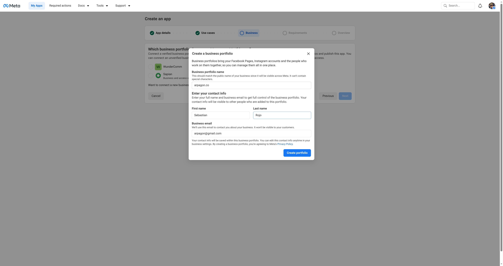
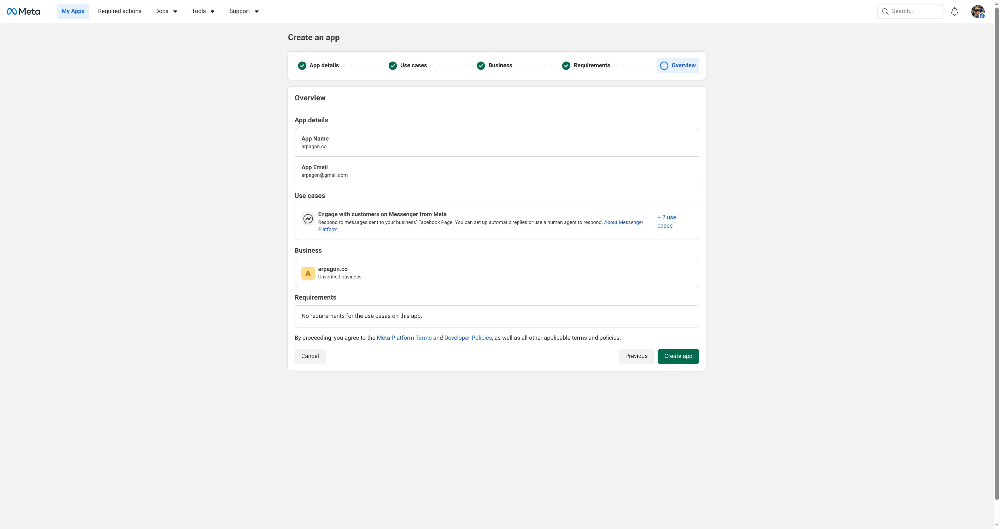
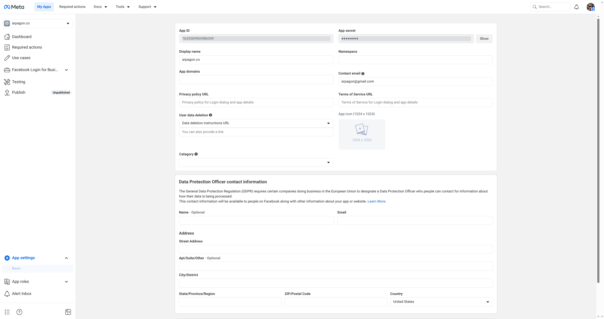
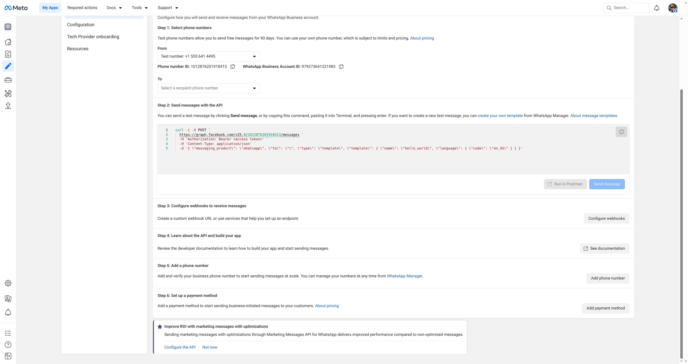
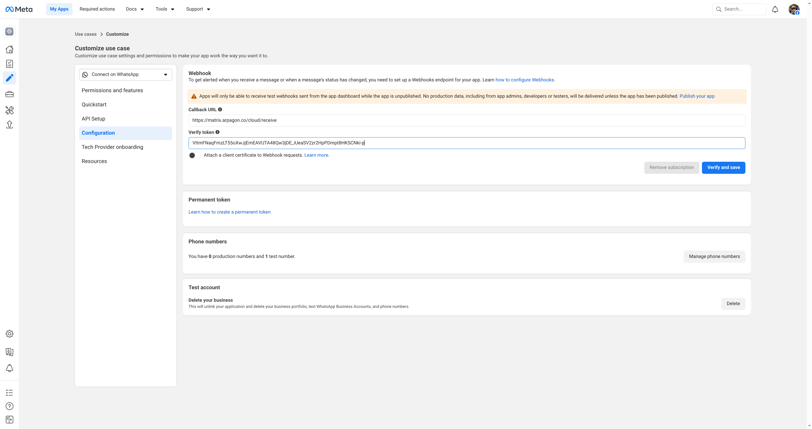
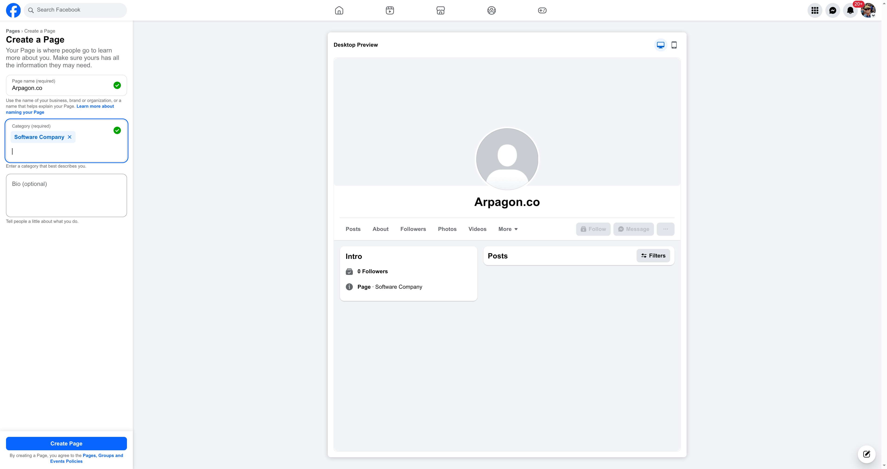

# Quick Start: Real E2E Deployment

This guide documents the **actual tested steps** to deploy meta-cloud-bridge with Matrix,
based on a real E2E test on 2026-05-09.

## Prerequisites

- Matrix homeserver (Synapse) running with a public URL (e.g., `https://matrix.arpagon.co`)
- PostgreSQL database
- Docker Compose
- A personal Facebook account
- Cloudflare Tunnel or similar for public HTTPS webhook

## Step 1: Create Meta Business Portfolio

1. Go to https://business.facebook.com/overview
2. Click "Create a Business Portfolio"
3. Fill in business name, your name, and email
4. Done — note the Business Portfolio ID from the URL

> If you already have a Business Portfolio, skip this step.



## Step 2: Create Meta Developer App

1. Go to https://developers.facebook.com/apps/
2. Click **"Create App"**
3. Fill in App name and contact email
4. In "Use cases", select **"Business messaging (3)"** — this adds WhatsApp, Messenger, and Instagram
5. Select your Business Portfolio (e.g., `arpagon.co`)
6. Review and click **"Create app"**
7. Confirm with your Facebook password



### Get App ID and App Secret

1. Go to App Settings → Basic
2. Note the **App ID** (visible in the URL too)
3. Click **"Show"** next to App Secret and copy it



## Step 3: Build and Deploy the Bridge

```bash
# In your docker-compose directory:
docker compose build meta-cloud-bridge
docker compose exec matrix-postgres psql -U synapse -c "CREATE DATABASE meta_cloud_bridge OWNER synapse;"
docker compose restart matrix-synapse  # reload appservice registration
docker compose up -d meta-cloud-bridge
docker compose restart matrix-tunnel   # reload cloudflare route
```

### Verify webhook is reachable

```bash
curl "https://your-domain.com/cloud/receive?hub.mode=subscribe&hub.verify_token=YOUR_VERIFY_TOKEN&hub.challenge=test"
# Should return: test
```

## Step 4: Configure WhatsApp

1. In the App Dashboard, click **"Customize the Connect with customers through WhatsApp use case"**
2. Go to **"API Setup"** tab
3. Accept the WhatsApp Business Platform terms
4. Note:
   - **Phone Number ID** (test number provided by Meta)
   - **WhatsApp Business Account ID (WABA ID)**
5. Click **"Generate access token"** — select your WhatsApp Business Account
6. Copy the temporary access token (expires in 24h)



### Configure WhatsApp Webhook

1. Go to **"Configuration"** tab
2. Set Callback URL: `https://your-domain.com/cloud/receive`
3. Set Verify token: same as `meta.verify_token` in bridge config
4. Click **"Verify and save"**



### Subscribe to WhatsApp webhook events (via API)

```bash
# Subscribe the app to the WABA
curl -X POST "https://graph.facebook.com/v25.0/{WABA_ID}/subscribed_apps" \
  -H "Authorization: Bearer {WHATSAPP_ACCESS_TOKEN}"

# Subscribe to whatsapp_business_account webhook fields
curl -X POST "https://graph.facebook.com/v25.0/{APP_ID}/subscriptions" \
  -H "Authorization: Bearer {APP_ID}|{APP_SECRET}" \
  -H "Content-Type: application/json" \
  -d '{
    "object": "whatsapp_business_account",
    "callback_url": "https://your-domain.com/cloud/receive",
    "verify_token": "YOUR_VERIFY_TOKEN",
    "fields": ["messages"]
  }'
```

### Add test recipient

1. In API Setup, open the **"To"** dropdown
2. Click **"Manage phone number list"**
3. Add your phone number with country code
4. Verify with the code sent via WhatsApp

### Test WhatsApp

```bash
# Send a test template message
curl -X POST "https://graph.facebook.com/v25.0/{PHONE_NUMBER_ID}/messages" \
  -H "Authorization: Bearer {ACCESS_TOKEN}" \
  -H "Content-Type: application/json" \
  -d '{
    "messaging_product": "whatsapp",
    "to": "YOUR_PHONE_NUMBER",
    "type": "template",
    "template": {"name": "hello_world", "language": {"code": "en_US"}}
  }'
```

Reply to the message on WhatsApp → it should appear in Matrix.
Send a message from Matrix → it should arrive on WhatsApp.

## Step 5: Configure Messenger

### Create a Facebook Page

1. Go to https://www.facebook.com/pages/create
2. Enter Page name and category
3. Create the Page (skip optional setup steps)



### Get Page Access Token

Use the OAuth dialog or Graph API Explorer to get a User Access Token with `pages_messaging` permission:

```bash
# OAuth URL (open in browser where you're logged into Facebook):
https://www.facebook.com/v25.0/dialog/oauth?client_id={APP_ID}&redirect_uri=https://developers.facebook.com/tools/explorer/callback&scope=pages_messaging,pages_manage_metadata,pages_show_list&response_type=token
```

Then get the Page token:

```bash
curl "https://graph.facebook.com/v25.0/me/accounts?fields=id,name,access_token" \
  -H "Authorization: Bearer {USER_ACCESS_TOKEN}"
```

Note the `id` (Page ID) and `access_token` (Page Access Token).

### Subscribe to Page webhook events

```bash
# Subscribe the Page to the app for Messenger events
curl -X POST "https://graph.facebook.com/v25.0/{PAGE_ID}/subscribed_apps" \
  -H "Authorization: Bearer {PAGE_ACCESS_TOKEN}" \
  -H "Content-Type: application/json" \
  -d '{"subscribed_fields": ["messages", "messaging_postbacks"]}'

# Subscribe app to page object webhooks
curl -X POST "https://graph.facebook.com/v25.0/{APP_ID}/subscriptions" \
  -H "Authorization: Bearer {APP_ID}|{APP_SECRET}" \
  -H "Content-Type: application/json" \
  -d '{
    "object": "page",
    "callback_url": "https://your-domain.com/cloud/receive",
    "verify_token": "YOUR_VERIFY_TOKEN",
    "fields": ["messages", "messaging_postbacks"]
  }'
```

### Test Messenger

1. Open `https://m.me/{PAGE_ID}` or find the Page on Facebook/Messenger
2. Send a message to the Page
3. It should appear in Matrix as a new DM
4. Reply from Matrix → it should arrive in Messenger

## Step 6: Update Bridge Config

Add accounts to `config.yaml`:

```yaml
meta:
  app_id: "YOUR_APP_ID"
  app_secret: "YOUR_APP_SECRET"
  webhook_path: /cloud
  verify_token: "YOUR_VERIFY_TOKEN"
  require_webhook_signature: true
  accounts:
    - id: whatsapp-main
      channel: whatsapp
      owner_mxid: "@admin:your-domain.com"
      waba_id: "YOUR_WABA_ID"
      phone_number_id: "YOUR_PHONE_NUMBER_ID"
      access_token: "YOUR_WHATSAPP_TOKEN"
    - id: messenger-page
      channel: messenger
      owner_mxid: "@admin:your-domain.com"
      page_id: "YOUR_PAGE_ID"
      access_token: "YOUR_PAGE_ACCESS_TOKEN"
```

The `owner_mxid` user is automatically linked to the account on bridge startup —
no manual database intervention needed.

## Lessons Learned

1. **Webhook subscriptions are per-object**: You need separate `POST /{APP_ID}/subscriptions` calls for `whatsapp_business_account` and `page` objects.

2. **Page webhook subscription is two-step**: Both `POST /{PAGE_ID}/subscribed_apps` (Page-level) AND `POST /{APP_ID}/subscriptions` with `object: "page"` (App-level) are required.

3. **The Meta Developer Dashboard UI changed**: The old "Add Product" flow is replaced with a "Use cases" wizard. WhatsApp, Messenger, and Instagram are under "Business messaging".

4. **WhatsApp tokens are temporary (24h)**: For production, create a System User in the Business Portfolio and generate a permanent token.

5. **Development Mode is sufficient for testing**: Only users with app roles can interact with your Page via Messenger. No App Review needed for E2E testing.

6. **The bridge auto-links `owner_mxid`**: Users configured as `owner_mxid` in accounts are automatically authorized to send messages through the bridge on startup.

7. **Puppet display names**: WhatsApp provides contact names via webhook payload. Messenger shows PSIDs until profile lookup is implemented.

## Screenshots

All screenshots from the real setup process are in `docs/screenshots/`:

- `03-select-business-portfolio.png` — Business portfolio selection
- `04-create-business-portfolio.png` — Creating new portfolio
- `05-portfolio-created.png` — Portfolio creation success
- `06-portfolio-selected.png` — Portfolio selected for app
- `07-requirements.png` — Publishing requirements info
- `08-app-overview-before-create.png` — App overview before creation
- `09-app-dashboard.png` — App dashboard after creation
- `10-app-settings-basic.png` — App ID and Secret location
- `11-whatsapp-terms.png` — WhatsApp Business terms
- `12-whatsapp-api-setup.png` — WhatsApp API Setup page
- `13-whatsapp-api-setup-details.png` — Phone Number ID, WABA ID, token
- `14-whatsapp-token-generated.png` — Access token generated
- `15-webhook-config.png` — Webhook configuration
- `16-webhook-verified.png` — Webhook verified successfully
- `17-add-test-recipient.png` — Adding test phone number
- `18-test-message-sent.png` — Test message sent
- `19-create-facebook-page.png` — Creating Facebook Page
- `20-facebook-page-created.png` — Page created successfully
